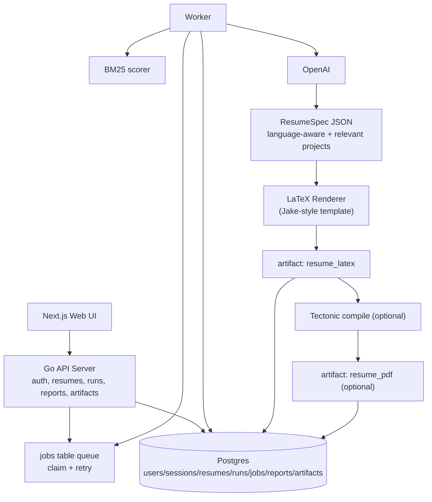

# Resume Tailor (WIP)

Resume Tailor is a backend-first system that compares a resume to a job description and produces:
- an ATS-style scorecard + change plan
- a tailored resume LaTeX artifact (and optional PDF artifact)

It is built as a product backend (auth, runs, queue worker, persistence), not a one-off script.

Status: under active development.

## Highlights
- End-to-end run pipeline: create run -> queue job -> worker generates outputs -> fetch report/artifacts.
- Authenticated API with session cookies (`HttpOnly`) and ownership checks on private resources.
- BM25 signal layer for explainable keyword coverage (missing, overlap, top terms).
- LLM resume pipeline now uses a structured JSON spec + deterministic LaTeX renderer.
- Renderer is modeled after a Jake-style template and supports resume-language-aware section labels.
- PDF generation is optional and best-effort (run can still succeed with LaTeX if PDF compile fails).

## Architecture


## Current Generation Flow
1. Worker loads `resume.content_text` and run `job_text`.
2. BM25 computes overlap/missing/top terms.
3. OpenAI generates:
   - ATS report + change plan
   - `ResumeSpec` JSON (not direct LaTeX)
4. Backend renderer converts `ResumeSpec` -> final LaTeX using project template style.
5. LaTeX artifact is saved as `resume_latex`.
6. If `RESUME_PDF_ENABLED=1`, worker tries PDF compile via Tectonic and stores `resume_pdf` when successful.

Notes:
- Resume tailoring preserves resume language (does not switch to job-posting language).
- Relevant projects are included with higher content density than earlier versions.
- PDF compile failure does not block run success when LaTeX is already generated.

## What Is Implemented

### Auth and Access Control
- Signup/login/logout with session cookies.
- Password hashing with bcrypt; session tokens stored as hashes.
- Middleware-based auth + ownership enforcement.

### Run Processing
- Run states: `queued -> running -> succeeded/failed`.
- DB-backed queue with retries.
- Worker orchestration for scoring, LLM generation, artifact storage.

### Outputs
- `run_reports`: ATS report + change plan.
- `run_artifacts_items`:
  - `resume_latex`
  - `resume_pdf` (optional)
- `run_artifacts`: metadata/path placeholders.

### Frontend
- Next.js app for login, resume submission, job submission, run polling, and artifact retrieval.

## API (v1)
All private endpoints require a valid session cookie.

Auth
- `POST /v1/auth/signup`
- `POST /v1/auth/login`
- `POST /v1/auth/logout`
- `GET  /v1/me`

Runs
- `POST /v1/runs`
- `GET  /v1/runs`
- `GET  /v1/runs/{runID}`
- `GET  /v1/runs/{runID}/report`
- `GET  /v1/runs/{runID}/artifacts/resume-latex`
- `GET  /v1/runs/{runID}/artifacts/resume-pdf`

Resumes
- `POST /v1/resumes`
- `GET  /v1/resumes`
- `GET  /v1/resumes/{resumeID}`

## Local Development
Prereqs: Go, Docker, Node.js, OpenAI API key.

```bash
cd backend
cp .env.example .env
# fill DATABASE_URL, OPENAI_API_KEY, etc.
make dev
```

This starts Postgres, runs migrations, starts API + worker, and runs the web app.

## Testing
```bash
cd backend
make test
make smoke
make verify
```

## Configuration
Important environment variables:
- `DATABASE_URL` (required)
- `OPENAI_API_KEY` (required for worker)
- `OPENAI_MODEL` (optional, default `gpt-4o-mini`)
- `HTTP_ADDR` (default `:8080`)
- `FRONTEND_ORIGIN` (default `http://localhost:3000`)
- `DISCORD_WEBHOOK_URL` (optional)
- `RESUME_PDF_ENABLED` (optional, set `1` to enable PDF compile attempts)
- `TECTONIC_BIN` (optional, path to `tectonic`)
- `GOOGLE_CLIENT_ID` (optional, enables Google OAuth)
- `GOOGLE_CLIENT_SECRET` (optional)
- `GOOGLE_REDIRECT_URL` (optional)

## Why This Project
Recruiters and applicants both need explainable resume feedback. Resume Tailor combines classic IR signals (BM25) with LLM-generated recommendations and deterministic rendering, wrapped in a production-style backend workflow.
