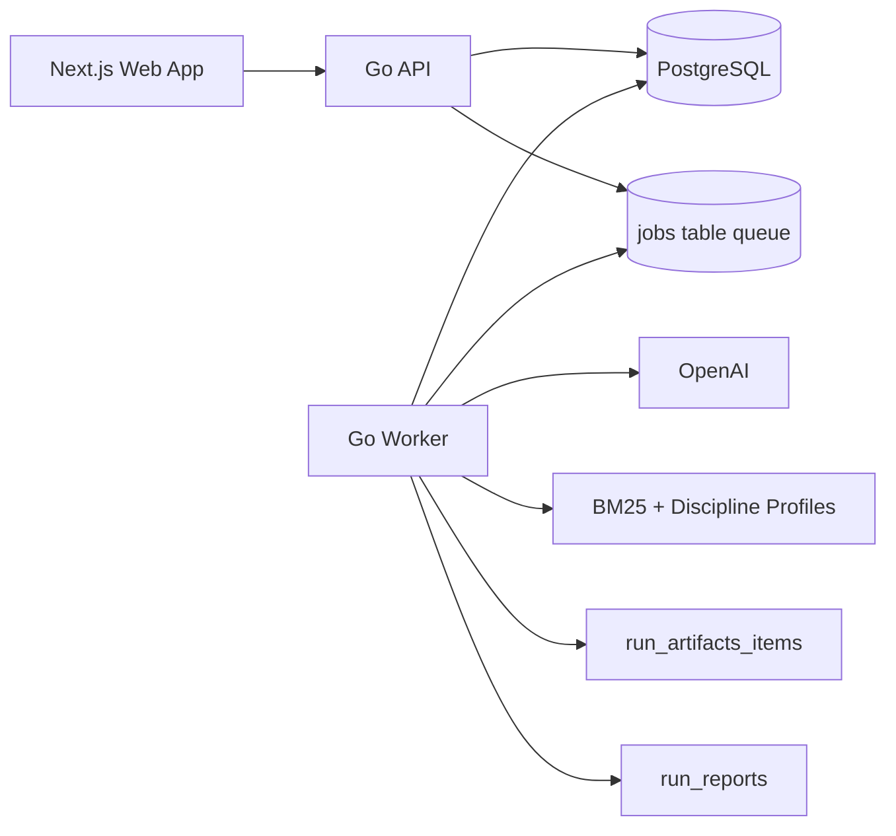

# Resume Tailor

Resume Tailor is a full-stack application that analyzes a resume against a job description and generates tailored application assets.

It combines profile-aware BM25 scoring with LLM generation and deterministic rendering in a production-style architecture:
- Go API for auth, resumes, runs, reports, and artifacts
- Go worker for asynchronous run processing
- PostgreSQL for persistence and queueing
- Next.js frontend for user workflows

## What It Generates
- ATS report (score, summary, notes, interview questions)
- Programmatic change plan based on BM25 diffs
- Tailored resume in LaTeX
- Tailored resume in DOCX
- Optional resume PDF (when PDF compilation is enabled)
- Cover letter text
- Cover letter DOCX
- Optional cover letter PDF
- Project relevance reasons (when project controls are provided)

## Key Capabilities
- Email/password auth with HttpOnly sessions
- Google OAuth login
- Password reset and email verification endpoints
- Resume upload (`.pdf` and `.docx`) with server-side text extraction
- Run queue with retries and worker-based processing
- Discipline detection and discipline-aware scoring/prompting
- User project controls (`pinned`, `auto`, `exclude`)
- BYOK (Bring Your Own OpenAI Key), encrypted at rest
- Security middleware (CSRF header checks, body limits, suspicious scan blocking)
- Optional Sentry and Discord webhook notifications

## BYOK and Limits

### BYOK
- Users can save a personal OpenAI API key via `PUT /v1/me/api-key`.
- Keys are encrypted server-side using AES-256-GCM before storage (`encrypted_openai_key`).
- During run processing, the worker uses the user's decrypted key when available; otherwise it falls back to the global `OPENAI_API_KEY`.
- BYOK requires `API_KEY_ENCRYPTION_SECRET` to be set on the server.

### Rate and Usage Limits
Run creation is guarded by multiple layers:
- Global IP rate limit: `60/min`
- Login rate limit: `5/min` per IP
- Signup rate limit: `3/hour` per IP
- Resume upload rate limit: `10/min` per IP
- Run create burst limit: `1/min` per user
- Run create daily limiter: `10/day` per user (in-memory limiter)
- Free-tier DB limits for users **without** BYOK:
  - `3/day` per user
  - `6/day` per creator IP

## Architecture


## Repository Layout
- `backend/cmd/api`: API server entrypoint
- `backend/cmd/worker`: worker entrypoint
- `backend/internal`: core domains (auth, runs, jobs, scoring, artifacts, http API, etc.)
- `backend/migrations`: SQL migrations + migration runner
- `backend/web`: Next.js frontend
- `backend/scripts`: dev/verify/smoke scripts
- `render.yaml`: Render service definitions

## Local Development

### Prerequisites
- Go `1.24+`
- Node.js `18+`
- Docker
- OpenAI API key (global fallback key for local worker)

### Quick Start (Recommended)
```bash
cd backend
cp .env.example .env
```

Set at least:
- `DATABASE_URL`
- `OPENAI_API_KEY`

Optional but recommended for BYOK support:
- `API_KEY_ENCRYPTION_SECRET`

Then run:
```bash
make dev
```

This script starts Postgres, applies migrations, runs API + worker, and starts the web app.

### Manual Start
```bash
cd backend
cp .env.example .env

docker compose up -d
go run ./cmd/api
go run ./cmd/worker

cd web
npm install
npm run dev
```

## Configuration
Important environment variables:

| Variable | Required | Description |
|---|---|---|
| `DATABASE_URL` | Yes | PostgreSQL connection string |
| `OPENAI_API_KEY` | Yes (for global fallback) | Global OpenAI key used when user has no BYOK key |
| `OPENAI_MODEL` | No | OpenAI model name (default `gpt-4o-mini`) |
| `API_KEY_ENCRYPTION_SECRET` | No* | Enables BYOK key storage/decryption (`*` required for BYOK) |
| `HTTP_ADDR` | No | API listen address (default `:8080`) |
| `FRONTEND_ORIGIN` | No | Allowed CORS origins (comma-separated) |
| `WORKER_ID` | No | Worker identifier |
| `WORKER_JOB_TIMEOUT` | No | End-to-end timeout per job (default `15m`) |
| `DISCIPLINE_MODE` | No | `off`, `observe`, or `enforce` (default `enforce`) |
| `RESUME_PDF_ENABLED` | No | Set `1` to enable PDF compile attempts |
| `TECTONIC_BIN` | No | Path to `tectonic` binary |
| `COOKIE_SECURE` / `COOKIE_SAMESITE` / `COOKIE_DOMAIN` | No | Session cookie behavior |
| `GOOGLE_CLIENT_ID` / `GOOGLE_CLIENT_SECRET` / `GOOGLE_REDIRECT_URL` | No | Google OAuth |
| `EMAIL_PROVIDER` / `EMAIL_API_KEY` / `EMAIL_FROM` | No | Transactional email provider |
| `SENTRY_DSN` | No | Error monitoring |
| `DISCORD_WEBHOOK_URL` | No | Event notifications |

## API Overview (`/v1`)

### Public
- `GET /`
- `GET /health`
- `POST /auth/signup`
- `POST /auth/login`
- `POST /auth/logout`
- `GET /auth/google/start`
- `GET /auth/google/callback`
- `GET /auth/verify`
- `POST /auth/forgot-password`
- `POST /auth/reset-password`

### Authenticated
- `GET /me`
- `PUT /me/password`
- `DELETE /me`
- `PUT /me/api-key`
- `DELETE /me/api-key`
- `POST /me/onboarding-seen`
- `POST /auth/resend-verification`

### Resumes
- `POST /resumes`
- `POST /resumes/upload`
- `GET /resumes`
- `GET /resumes/{resumeID}`

### Runs
- `POST /runs`
- `GET /runs`
- `GET /runs/{runID}`
- `GET /runs/{runID}/report`
- `POST /disciplines/detect`

### Artifact Downloads
- `GET /runs/{runID}/artifacts/resume-latex`
- `GET /runs/{runID}/artifacts/resume-pdf`
- `GET /runs/{runID}/artifacts/resume-docx`
- `GET /runs/{runID}/artifacts/cover-letter`
- `GET /runs/{runID}/artifacts/cover-letter-pdf`
- `GET /runs/{runID}/artifacts/cover-letter-docx`
- `GET /runs/{runID}/artifacts/project-reasons`

## Testing and Verification
From `backend`:
```bash
make test
make smoke
make verify
```

Notes:
- `make smoke` expects API/worker and required env vars.
- `make verify` runs formatting checks, tests, integration boot, and smoke flow.

## Deployment
The repository includes a Render blueprint in [`render.yaml`](render.yaml):
- `resume-tailor-api` (Go web service)
- `resume-tailor-worker` (Go worker)
- `resume-tailor-web` (Next.js web service)

## Additional Documentation
- Backend local dev: `backend/docs/local-dev.md`
- Backend testing notes: `backend/docs/testing.md`
- BM25 details: `backend/docs/bm25.md`
- Internal reference docs: `backend/docs/backend-reference/`
