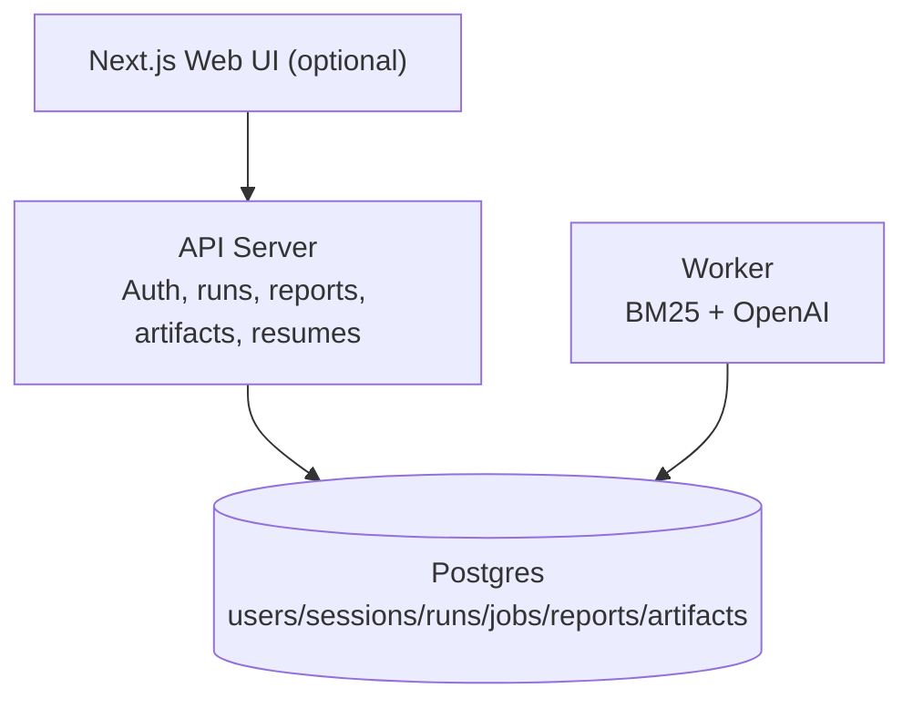

@ -0,0 +1,102 @@
# Resume Tailor (WIP)

Resume Tailor is a backend-first system that compares a resume to a job description and produces two outputs: an ATS-style scorecard and a prioritized change plan. It is built like a product (auth, runs, background jobs, persistence), not a script.

Status: under active development. Not deployed yet.

## Highlights
- End-to-end run pipeline: create run -> queue job -> worker generates outputs -> fetch report/artifacts.
- Authenticated API with session cookies (HttpOnly) and ownership checks on every private resource.
- Structured ATS report + change plan generated with OpenAI, validated before storage.
- BM25 term-signal layer for explainable keyword coverage (missing, overlap, top terms).
- LaTeX resume generation stored as an artifact for each run (PDF compilation planned).
- Postgres schema for runs, reports, artifacts, jobs, and optional subscription/usage tracking.

## Architecture


## What is implemented
### Auth and access control
- Signup/login/logout with session cookies.
- Passwords hashed with bcrypt; session tokens are stored as hashes.
- Auth middleware protects private endpoints and enforces ownership.

### Run processing pipeline
- Runs move through queued -> running -> succeeded/failed.
- Database-backed job queue with retries.
- Worker loads resume + job text, computes BM25 signals, calls OpenAI, stores outputs.

### Outputs
- ATS report + change plan stored in `run_reports`.
- Resume LaTeX stored in `run_artifacts_items` as `resume_latex`.
- Artifact metadata (paths/placeholders) stored in `run_artifacts` for future PDF pipeline.

### Frontend (basic UI)
- Next.js app for login, resume input, job input, and LaTeX results polling.
- Uses cookie-based auth and polls the artifact endpoint until ready.

## API (v1)
All private endpoints require a session cookie.

Auth
- `POST /v1/auth/signup`
- `POST /v1/auth/login`
- `POST /v1/auth/logout`
- `GET  /v1/me`

Runs
- `POST /v1/runs` (create run)
- `GET  /v1/runs` (list runs)
- `GET  /v1/runs/{runID}`
- `GET  /v1/runs/{runID}/report`
- `GET  /v1/runs/{runID}/artifacts/resume-latex`

Resumes
- `POST /v1/resumes` (text resume MVP)
- `GET  /v1/resumes`
- `GET  /v1/resumes/{resumeID}`

## Local development
Prereqs: Go, Docker, Node.js, and an OpenAI API key.

```
cp .env.example .env
# fill in DATABASE_URL, OPENAI_API_KEY, etc.
make dev
```

This boots Postgres, applies migrations, starts API + worker, and runs the web app.

## Testing and verification
```
make test    # go test ./...
make smoke   # runs e2e smoke flow (API + worker must be running)
make verify  # full check: gofmt, tests, fresh DB, e2e
```

## Configuration
Environment variables:
- `DATABASE_URL` (required)
- `OPENAI_API_KEY` (required for worker)
- `OPENAI_MODEL` (optional, default `gpt-4o-mini`)
- `HTTP_ADDR` (default `:8080`)
- `FRONTEND_ORIGIN` (default `http://localhost:3000`)

## Roadmap
- PDF compilation pipeline for LaTeX artifacts.
- More rigorous BM25 explainability and calibration.
- Richer report schemas + versioned prompts.
- Deployment hardening (rate limits, observability, storage).

## Why this project
Recruiters and applicants both need *explainable* resume feedback. Resume Tailor combines classic IR signals (BM25) with LLM-generated guidance, wrapped in a real backend workflow with authentication, runs, and reproducible outputs.
